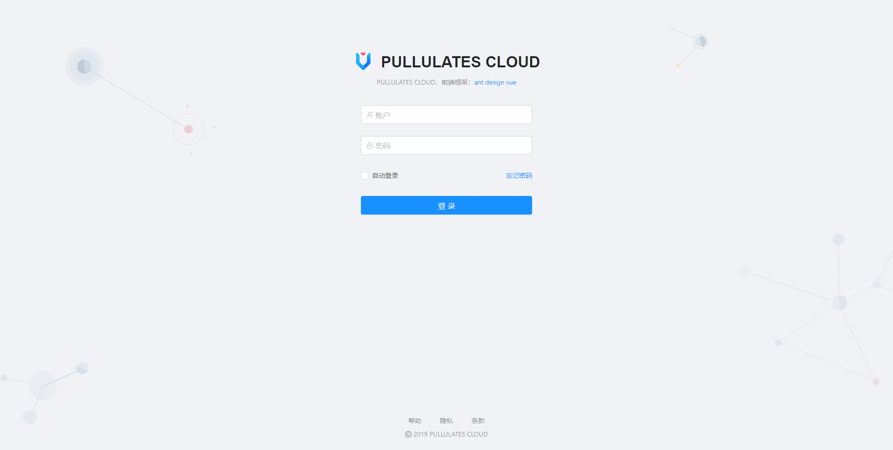
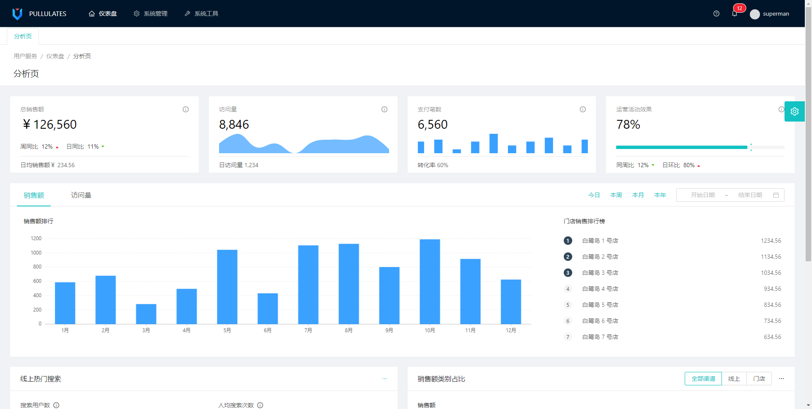
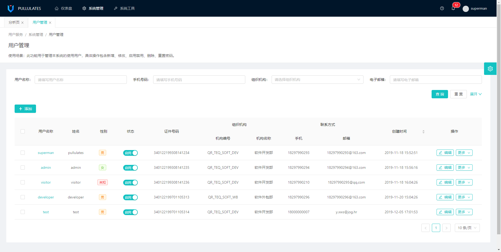
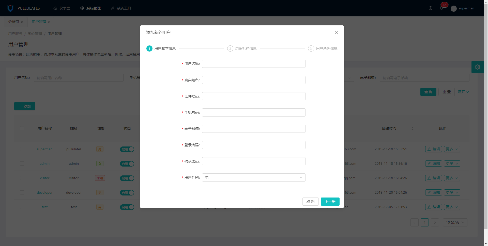
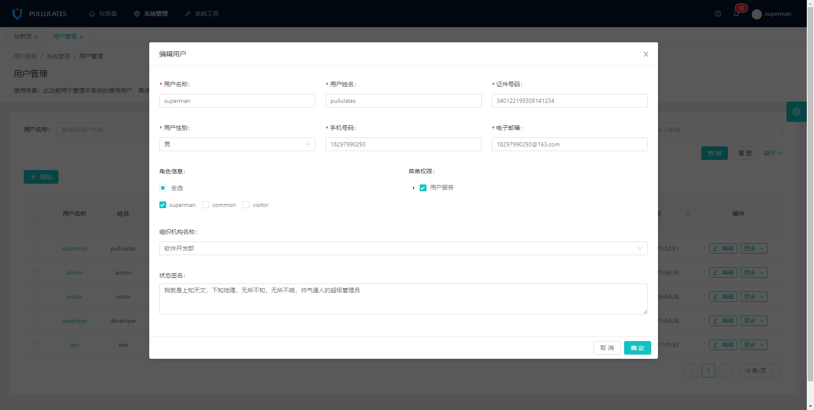
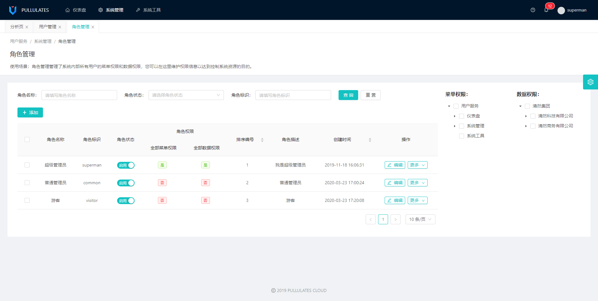
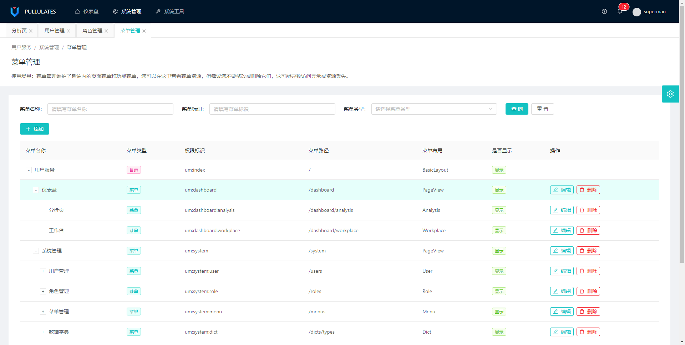
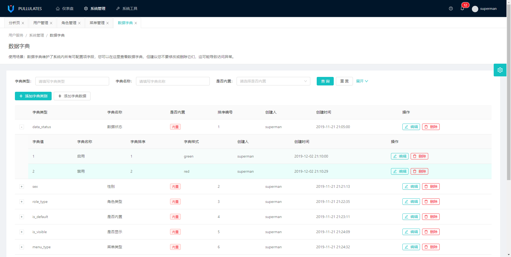
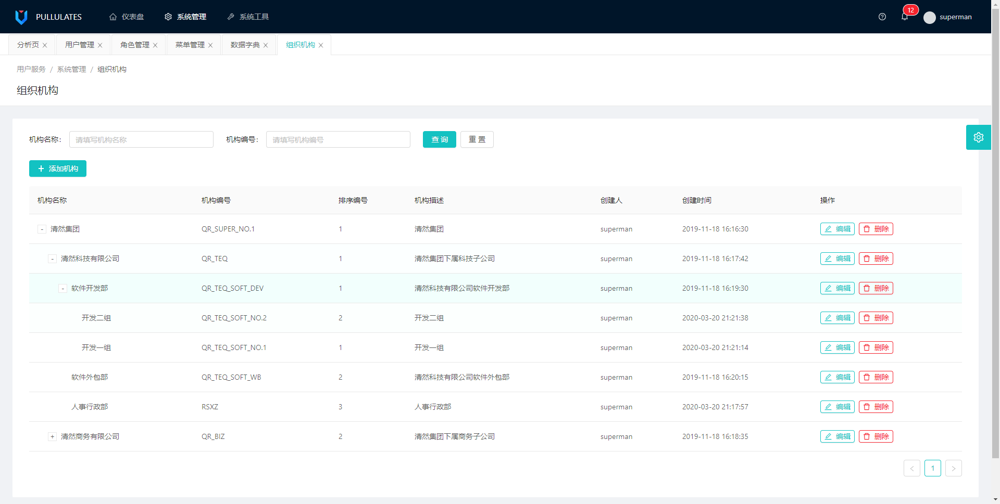

# PULLULATES CLOUD

## 项目介绍

**PULLULATES CLOUD是一款微服务系统，包含pullulates-server和pullulates-vue两个部分**
**项目仅包含一般管理系统的最基础部分，包括用户管理、角色管理、菜单管理、数据字典、组织机构管理，您可以在此基础上任意地添加自定义的功能**

> pullulates-server

1. pullulates-server使用spring cloud开发，集成了eureka、sleuth、config、ribbon、hystrix、zuul五大核心组件；
2. 项目使用Idea工具开发，包集成了spring seurity、jwt、redis、mybatis、mysql、pagehelper等时下流行的技术或框架；
3. 此部分因代码在维护升级中，暂不开源...

> pullulates-vue

1. pullulates-vue是项目的前端部分，开发语言为vue；
2. 使用 vs code 工具开发，管理工具使用yarn；
3. 前端框架使用 [Ant Design of Vue](https://www.antdv.com/docs/vue/introduce-cn/ "a")
4. 此部分代码已开放,代码传送门：[pullulates-vue](https://github.com/pullulates/pullulates-vue "pullulates-vue")

## 项目体验
#### 1.体验账号：superman/superman
#### 2.演示地址：[PULLULATES CLOUD](http://129.211.62.37 "PULLULATES CLOUD")

## 如何使用

#### pullulates-vue

> 下载代码

您可以使用git直接clone代码，也可以在登录后下载打包后的源码
```java
git clone https://github.com/pullulates/pullulates-vue.git
```

> 环境要求

1. 安装node.js环境，配置yarn
2. 下载安装 vs code
3. 打开编辑器，添加项目至工作区间内，右键打开终端
4. 运行yarn run serve即可

## 快速查看

> 用户登录



> 系统首页



> 用户列表



> 用户新增



> 用户编辑



> 角色列表



> 菜单列表



> 数据字典



> 组织机构



### End